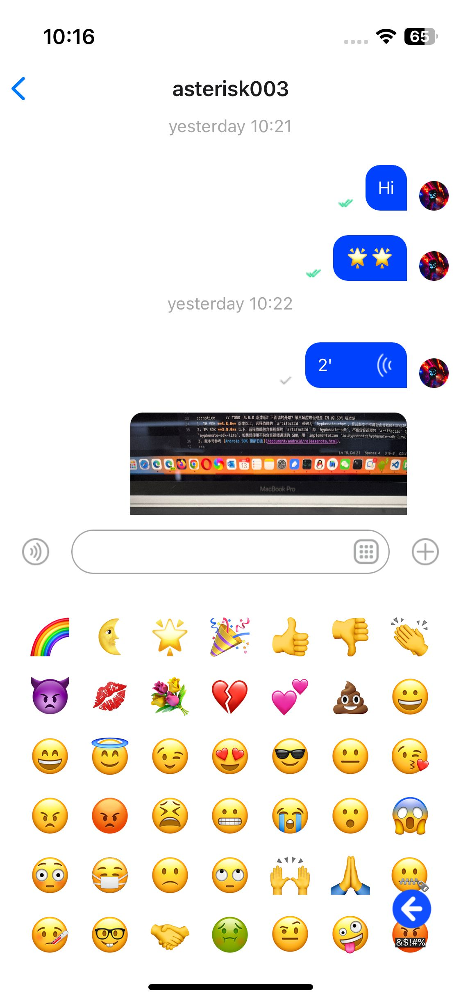
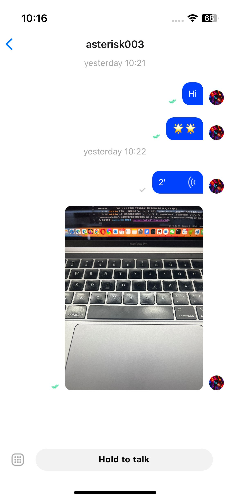
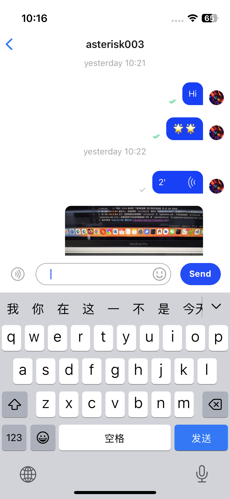

# 聊天详情页面

聊天组件提供了丰富的功能，支持文本、表情、图片、语音、文件等多种类型消息的输入。 支持显示消息列表、自定义头像、自定义消息状态、自定义消息气泡，并可以更改消息状态。

## 它提供的方法包括：

- sendTextMessage：发送短信。
- sendImageMessage：发送图像消息。
- sendVoiceMessage：发送语音消息。
- sendCustomMessage：发送自定义消息。
- sendFileMessage：发送文件消息。
- sendVideoMessage：发送视频消息。
- sendLocationMessage：发送位置消息。
- loadHistoryMessage：加载历史消息。
- deleteLocalMessage：删除本地消息。
- resendMessage：重新发送发送失败的消息。
- downloadAttachment：下载邮件附件。

## 它提供的属性和回调通知包括：

- propsRef：设置聊天组件控制器。
- screenParams：设置聊天组件的参数。
- messageBubbleList：设置自定义消息气泡组件。
- onUpdateReadCount：未读消息计数更新时发生。
- onClickMessageBubble：单击消息气泡通知时发生
- onLongPressMessageBubble：按住消息气泡时发生。
- onClickInputMoreButton：按下“更多”按钮时发生。
- onPressInInputVoiceButton：按下语音按钮时发生。
- onPressOutInputVoiceButton：释放语音按钮时发生。
- onSendMessage：当消息开始发送时发生。
- onSendMessageEnd：消息发送完成时发生。
- onVoiceRecordEnd：语音消息录制完成时发生。

## 最简单的集成示例如下：

```typescript
import * as React from "react";
import { ChatFragment, ScreenContainer } from "react-native-chat-uikit";
export default function ChatScreen(): JSX.Element {
  const chatId = "xxx";
  const chatType = 0;
  return (
    <ScreenContainer mode="padding" edges={["right", "left", "bottom"]}>
      <ChatFragment screenParams={{ chatId, chatType }} />
    </ScreenContainer>
  );
}
```

## 自定义：录制完语音后，您可能需要发送语音消息。

```typescript
export default function ChatScreen(): JSX.Element {
  const chatId = "xxx";
  const chatType = 0;
  return (
    <ScreenContainer mode="padding" edges={["right", "left", "bottom"]}>
      <ChatFragment
        screenParams={{ chatId, chatType }}
        onVoiceRecordEnd={(params) => {
          chatRef.current.sendVoiceMessage(params);
        }}
      />
    </ScreenContainer>
  );
}
```

## 自定义：当默认的聊天气泡无法满足自定义需求时，您可以自行设计聊天气泡的样式。

`MessageBubbleList` 是自定义聊天气泡列表组件。可以修改任何气泡内容，例如：头像、文字、图片、语音样式、消息状态等。

`TextMessageItem` 是自定义文本消息样式，可以自定义。 8 种消息类型都支持自定义。

```typescript
import type { MessageBubbleListProps } from "../fragments/MessageBubbleList";
import MessageBubbleList from "../fragments/MessageBubbleList";
export default function ChatScreen(): JSX.Element {
  const chatId = "xxx";
  const chatType = 0;
  return (
    <ScreenContainer mode="padding" edges={["right", "left", "bottom"]}>
      <ChatFragment
        screenParams={{ chatId, chatType }}
        messageBubbleList={{
          MessageBubbleListP: MessageBubbleListFragment,
          MessageBubbleListPropsP: {
            TextMessageItem: MyTextMessageBubble,
            VideoMessageItem: MyVideoMessageBubble,
            FileMessageItem: MyFileMessageBubble,
          } as MessageBubbleListProps,
          MessageBubbleListRefP: messageBubbleListRefP as any,
        }}
      />
    </ScreenContainer>
  );
}
```

## 自定义：点击消息气泡回调通知。例如：播放语音、预览图片等。

```typescript
export default function ChatScreen(): JSX.Element {
  const chatId = "xxx";
  const chatType = 0;
  return (
    <ScreenContainer mode="padding" edges={["right", "left", "bottom"]}>
      <ChatFragment
        screenParams={{ chatId, chatType }}
        onClickMessageBubble={(data: MessageItemType) => {
          // TODO: If it is a voice message, it plays it, if it is a picture message, it previews it.
        }}
      />
    </ScreenContainer>
  );
}
```

## 自定义：长按消息气泡通知。例如：可以显示不同上下文菜单。

```typescript
export default function ChatScreen(): JSX.Element {
  const chatId = "xxx";
  const chatType = 0;
  return (
    <ScreenContainer mode="padding" edges={["right", "left", "bottom"]}>
      <ChatFragment
        screenParams={{ chatId, chatType }}
        onLongPressMessageBubble={() => {
          // TODO: Displays the context menu. For example, message forwarding, message deletion, message resending, etc.
        }}
      />
    </ScreenContainer>
  );
}
```

## 自定义：发送消息前通知。可以做自定义处理。

```typescript
export default function ChatScreen(): JSX.Element {
  const chatId = "xxx";
  const chatType = 0;
  return (
    <ScreenContainer mode="padding" edges={["right", "left", "bottom"]}>
      <ChatFragment
        screenParams={{ chatId, chatType }}
        onSendMessage={(message: ChatMessage) => {
          // TODO: Update the message.
        }}
      />
    </ScreenContainer>
  );
}
```

## 自定义：发送消息完成通知。可以更新消息状态。

```typescript
export default function ChatScreen(): JSX.Element {
  const chatId = "xxx";
  const chatType = 0;
  return (
    <ScreenContainer mode="padding" edges={["right", "left", "bottom"]}>
      <ChatFragment
        screenParams={{ chatId, chatType }}
        onSendMessageEnd={(message: ChatMessage) => {
          // TODO: Update message status, success or failure.
        }}
      />
    </ScreenContainer>
  );
}
```

## 自定义：自定义背景色

```typescript
export default function ChatScreen(): JSX.Element {
  const chatId = "xxx";
  const chatType = 0;
  return (
    <ScreenContainer mode="padding" edges={["right", "left", "bottom"]}>
      <ChatFragment
        screenParams={{ chatId, chatType }}
        messageBubbleList={{
          MessageBubbleListP: MessageBubbleListFragment,
          MessageBubbleListPropsP: {
            style: { backgroundColor: "yellow" },
          } as MessageBubbleListProps,
          MessageBubbleListRefP: messageBubbleListRefP as any,
        }}
      />
    </ScreenContainer>
  );
}
```

## 自定义：时间标签显示和隐藏。

```typescript
export default function ChatScreen(): JSX.Element {
  const chatId = "xxx";
  const chatType = 0;
  return (
    <ScreenContainer mode="padding" edges={["right", "left", "bottom"]}>
      <ChatFragment
        screenParams={{ chatId, chatType }}
        messageBubbleList={{
          MessageBubbleListP: MessageBubbleListFragment,
          MessageBubbleListPropsP: {
            showTimeLabel: false,
          } as MessageBubbleListProps,
          MessageBubbleListRefP: messageBubbleListRefP as any,
        }}
      />
    </ScreenContainer>
  );
}
```







https://user-images.githubusercontent.com/11733363/241342789-e5fed2c3-ede4-47f4-86c3-c185800158f0.mov
